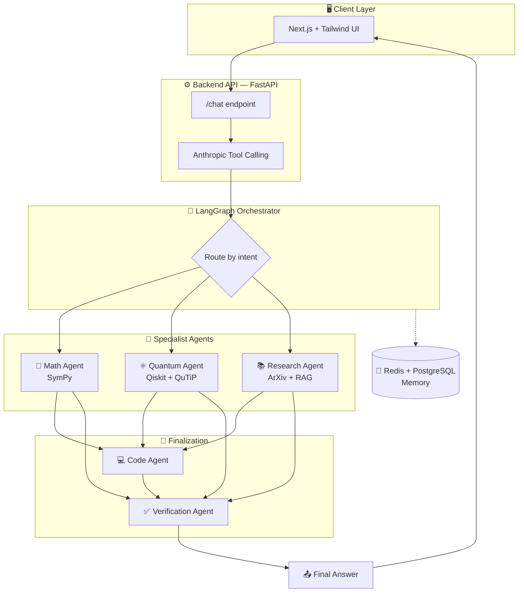
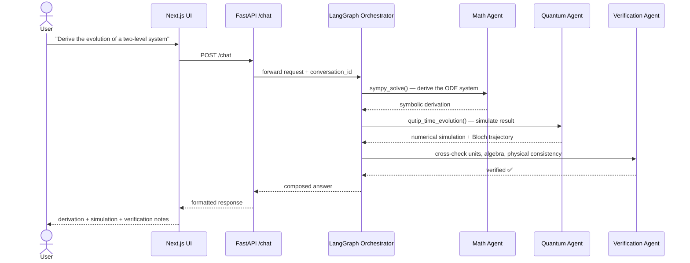
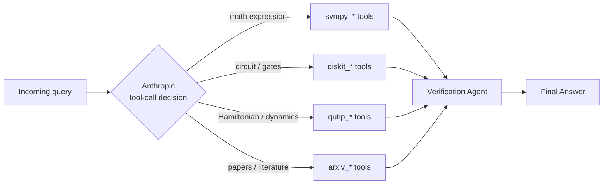

```
   ____    __  _______        __________  ______
  / __ \  /  |/  / __ \      / ____/ __ \/_  __/
 / / / / / /|_/ / /_/ /_____/ / __/ /_/ / / /   
/ /_/ / / /  / / _, _/_____/ /_/ / ____/ / /    
\___\_\/_/  /_/_/ |_|      \____/_/     /_/     
```

# ⚛️ QuantumMathResearchGPT

### *A Multi-Agent Scientific Copilot for Mathematics, Quantum Physics & Research*

[](#-tech-stack)
[](#-tech-stack)
[](#-tech-stack)
[](#-tech-stack)
[](#-tech-stack)
[](#-tool-calling)
[](#-license)

> *"A derivation is only as trustworthy as its weakest assumption. QuantumMathResearchGPT exists to carry every equation — symbolic, numeric, and physical — through to a verified answer, not just a plausible-looking one."*

---

## 🧭 Table of Contents

- [Overview](#-overview)
- [Features](#-features)
- [Architecture](#️-architecture)
- [Agent Workflow](#-agent-workflow)
- [Tech Stack](#-tech-stack)
- [Tool Calling](#-tool-calling)
- [Setup](#-setup)
- [Usage](#️-usage)
- [API Reference](#-api-reference)
- [Project Structure](#-project-structure)
- [Roadmap](#️-roadmap)
- [Author](#-author)

---

## 🌌 Overview

**QuantumMathResearchGPT** combines Large Language Models with specialized computational tools to provide rigorous mathematical derivations, quantum simulations, symbolic calculations, scientific research support, and code generation.

| | |
|---|---|
| 🧠 **Reasoning engine** | Anthropic Claude, tool-calling based |
| 🔀 **Orchestration** | LangGraph multi-agent graph |
| 🧮 **Math** | SymPy · NumPy · SciPy |
| ⚛️ **Quantum** | Qiskit · QuTiP |
| 📚 **Research** | ArXiv API + hybrid RAG |
| 🖥️ **Frontend** | Next.js 15 · Tailwind · shadcn/ui |
| 💾 **Memory** | Redis · PostgreSQL |

---

## ✨ Features

<table>
<tr>
<td width="50%" valign="top">

### 🧮 Mathematical Reasoning
- Step-by-step derivations
- Symbolic simplification
- Calculus and differential equations
- Linear algebra and matrix operations
- Tensor algebra and eigenvalue problems
- Assumption-aware solutions

### ⚛️ Quantum Physics
- Schrödinger equation
- Operators and observables
- Bra-ket notation
- Density matrices
- Quantum harmonic oscillator
- Spin systems
- Perturbation theory

</td>
<td width="50%" valign="top">

### 🔬 Quantum Computing
- Qubits and quantum gates
- Bell states
- Bloch sphere
- Quantum Fourier Transform
- Grover's Algorithm
- Shor's Algorithm
- Quantum circuit simulation

### 🧠 Scientific Research Assistant
- Literature review support
- Paper summarization
- Research gap identification
- Method comparison
- Hypothesis generation
- Future work suggestions

</td>
</tr>
</table>

| ✅ Verification-Oriented Output |
|---|
| Unit consistency checks · Algebraic verification · Numerical validation · Physical consistency checks · Assumption tracking |

<details>
<summary><b>💻 Code Generation — click to expand supported stacks</b></summary>
<br>

| Language / Framework | Use Case |
|---|---|
| Python | General scientific scripting |
| NumPy / SciPy | Numerical computation |
| SymPy | Symbolic mathematics |
| Qiskit | Quantum circuit design |
| QuTiP | Open quantum system dynamics |
| PyTorch / TensorFlow | ML-based research workflows |
| MATLAB | Engineering-style simulations |
| Julia | High-performance numerics |

</details>

---

## 🏗️ Architecture



---

## 🔄 Agent Workflow

Example: a user asks to *"derive the evolution of a two-level system and simulate it."*



---

## 🧰 Tech Stack

| Layer | Technologies |
|---|---|
| 🐍 **Backend** |    |
| 🧮 **Math Engines** |    |
| ⚛️ **Quantum Frameworks** |   |
| 📚 **Research & RAG** |     |
| 🖥️ **Frontend** |      |
| 💾 **Memory** |   |

---

## 🔧 Tool Calling

Anthropic tool calling automatically invokes the right backend tool based on the query — no manual routing required.



<details>
<summary><b>🧮 Mathematical Tools</b></summary>

```python
sympy_simplify()
sympy_integrate()
sympy_differentiate()
sympy_solve()
sympy_matrix()
```
</details>

<details>
<summary><b>🔬 Quantum Tools (Qiskit)</b></summary>

```python
qiskit_create_circuit()
qiskit_simulate()
qiskit_statevector()
```
</details>

<details>
<summary><b>⚛️ QuTiP Tools</b></summary>

```python
qutip_hamiltonian()
qutip_time_evolution()
qutip_density_matrix()
```
</details>

<details>
<summary><b>📚 Research Tools</b></summary>

```python
arxiv_search()
paper_summary()
citation_analysis()
```
</details>

---

## 🚀 Setup

### Prerequisites

```
Python  >= 3.11
Node.js >= 18.0.0
Redis   >= 7.0
PostgreSQL >= 14
```

### Backend

```bash
# 1. Install dependencies
pip install -r requirements.txt

# 2. Configure environment variables
cp .env.example .env
```

`.env`
```env
ANTHROPIC_API_KEY=your_key_here
```

```bash
# 3. Run the API
uvicorn app.main:app --reload --port 8000
```

### Frontend

```bash
# 1. Install dependencies
npm install
```

`.env.local`
```env
NEXT_PUBLIC_API_URL=http://localhost:8000
```

```bash
# 2. Run the dev server
npm run dev
```

---

## ▶️ Usage

```bash
# Terminal 1 — backend
uvicorn app.main:app --reload

# Terminal 2 — frontend
npm run dev
```

Then open **http://localhost:3000**.

### 💡 Example Prompts

| Domain | Prompt |
|---|---|
| 📐 Mathematics | *Solve and verify:* `x³ - 6x² + 11x - 6 = 0` |
| ⚛️ Quantum Physics | *Derive the time-independent Schrödinger equation for a particle in a box.* |
| 🔬 Quantum Computing | *Simulate a Bell state circuit and verify expected correlations.* |
| 📚 Research | *Summarize recent papers on Variational Quantum Algorithms.* |

---

## 📡 API Reference

### `POST /chat`

**Request**
```json
{
  "user_message": "Derive the evolution of a two-level system",
  "conversation_id": "optional"
}
```

**Response**
```json
{
  "conversation_id": "uuid",
  "answer": "formatted response",
  "debug": {}
}
```

---

## 📁 Project Structure

```
QuantumMathResearchGPT/
│
├── app/
│   ├── api/
│   ├── models/
│   ├── routes/
│   ├── services/
│   └── main.py
│
├── agents/
│   ├── orchestrator/
│   ├── math_agent/
│   ├── quantum_agent/
│   ├── symbolic_agent/
│   ├── numerical_agent/
│   ├── research_agent/
│   ├── code_agent/
│   ├── verifier_agent/
│   └── memory_agent/
│
├── tools/
│   ├── sympy_tools.py
│   ├── qiskit_tools.py
│   ├── qutip_tools.py
│   └── arxiv_tools.py
│
├── rag/
├── frontend/
├── memory/
├── tests/
├── docs/
├── requirements.txt
└── README.md
```

---

## 🗺️ Roadmap

- [ ] PDF understanding
- [ ] ArXiv RAG
- [ ] Wolfram Engine integration
- [ ] LaTeX rendering
- [ ] Image-to-equation OCR
- [ ] Voice interaction
- [ ] Multi-modal capabilities
- [ ] Autonomous research workflows
- [ ] Fine-tuned scientific model

---

## 📜 License

Distributed under the **MIT License**.

---

## 👤 Author

**Boukrioui Nadir**
*AI Engineer • Quantum Computing Enthusiast • Scientific AI Researcher*

[]()
[]()

---

<div align="center">

*Not just a chatbot — a Scientific Copilot for Mathematics and Quantum Physics.*

</div>
